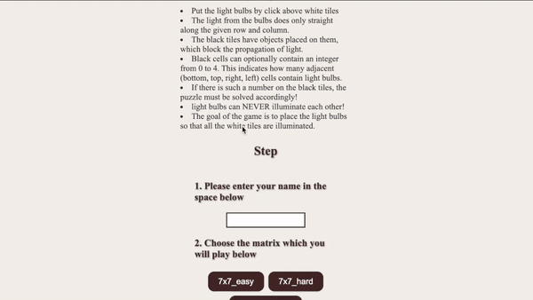

# Lightbulb Placement Game

## Description
This is a lightbulb placement puzzle game implemented in JavaScript. The objective of the game is to illuminate all the white tiles by strategically placing light bulbs on the board.

## How to Play
- Click on a white tile to place a light bulb.
- Light beams travel only in straight lines along the row and column from the light bulb.
- Black tiles may contain objects that block the light’s path.
- Some black tiles may contain a number between 0 to 4, indicating how many of the adjacent tiles (up, down, left, right) must have light bulbs.
- Ensure that light bulbs do not illuminate each other.
- The puzzle is solved when all white tiles are illuminated.

## Steps to Play
1. Enter your name in the provided space.
2. Select the difficulty level: `7x7_easy`, `7x7_hard`, or `10x10_normal`.
3. After solving the puzzle, click the "Check" button to verify your solution.

Enjoy the game and light up the tiles!
